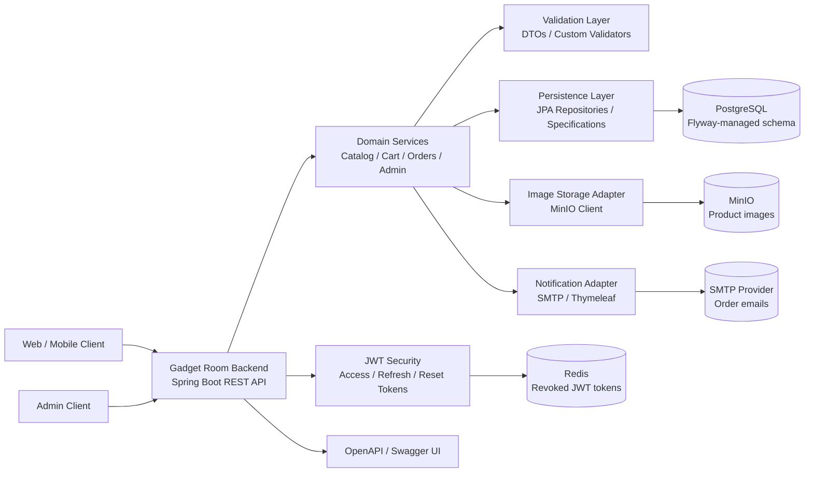

# Gadget Room Backend

> Production-ready REST API for an online phone store: catalog, cart, orders, admin dashboard, JWT authentication,
> image storage, email notifications and CI quality gates.

## Core Features

- [x] **Authentication:** registration, login, access tokens, refresh tokens and password reset flow.
- [x] **Catalog:** phone listing, product details, filtering, sorting, pagination and brand discovery.
- [x] **Cart:** authenticated user cart with add, remove, clear and total recalculation operations.
- [x] **Orders:** order creation, customer order history, delivery details and payment details validation.
- [x] **Admin Panel API:** product, order, customer and dashboard endpoints protected by admin role.
- [x] **Image Storage:** product image upload, metadata retrieval and binary image serving through MinIO.
- [x] **Email Notifications:** order confirmation emails with server-side templates.
- [x] **API Documentation:** OpenAPI documentation with JWT bearer authentication support for local/dev usage.

## Engineering Highlights

- [x] **Layered Architecture:** controllers, services, repositories, mappers, validators and DTO contracts are separated.
- [x] **Database Versioning:** Flyway migrations keep schema changes explicit and reproducible.
- [x] **Security:** stateless JWT authentication, BCrypt password hashing, role-based authorization and configurable CORS.
- [x] **Production Hardening:** production profile disables dev-only endpoints and public API docs, rate-limits auth-sensitive endpoints, and exposes safe health checks.
- [x] **Object Storage:** MinIO integration isolates image files from relational data.
- [x] **Token Revocation Store:** Redis keeps revoked access and refresh tokens available across app restarts.
- [x] **Validation:** custom validators cover order delivery, payment details, cart rules and filter constraints.
- [x] **Testing:** unit and integration tests cover controllers, services, storage and validation logic.
- [x] **Quality Gate:** JaCoCo enforces a 70% minimum line coverage threshold in CI.
- [x] **Containerization:** Docker and Docker Compose provide reproducible local and production environments.

## Tech Stack

`Java 21` | `Spring Boot 3.5` | `Spring Security` | `Spring Data JPA` | `PostgreSQL` | `Flyway` | `Redis` | `MinIO` | `JWT` |
`MapStruct` | `Lombok` | `Docker` | `JUnit 5` | `Mockito` | `Testcontainers` | `JaCoCo` | `OpenAPI`

## Architecture



Detailed architecture notes: [`docs/ARCHITECTURE.md`](docs/ARCHITECTURE.md)

## Main API Areas

| Area | Base path |
| --- | --- |
| Authentication | `/api/auth` |
| Users | `/api/v1/users` |
| Phones | `/api/v1/phones` |
| Filtering | `/api/v1/filter` |
| Images | `/api/v1/images` |
| Cart | `/api/v1/me/cart` |
| Orders | `/api/v1/orders` |
| Admin | `/api/v1/admin/**` |

## API Documentation

- Swagger UI and OpenAPI JSON are enabled for local/dev usage only.
- Local Swagger UI: `http://localhost:8080/swagger-ui.html`
- Local OpenAPI JSON: `http://localhost:8080/v3/api-docs`

## Production Readiness

The `prod` profile is the release profile for externally reachable environments:

- `/api/v1/test-data/**` is not registered in `prod`.
- Swagger UI and `/v3/api-docs` are disabled in `prod`.
- `/actuator/health`, `/actuator/health/liveness`, and `/actuator/health/readiness` are public health endpoints.
- Other actuator endpoints are protected by the admin role and are not exposed unless explicitly included.
- Health checks include application liveness/readiness, PostgreSQL, Redis and MinIO.
- Auth-sensitive endpoints are rate-limited: login, refresh token, forgot password and reset password.

Production rate limits can be tuned with:

```text
AUTH_RATE_LIMIT_REQUESTS_PER_WINDOW=10
AUTH_RATE_LIMIT_WINDOW=1m
```

## QA Guides

- Ukrainian: [`qa/guide_ua.md`](qa/guide_ua.md)
- English: [`qa/guide_en.md`](qa/guide_en.md)

## Run

```bash
docker compose --env-file test.env up --build
```

Reset local Docker volumes when Flyway migrations changed or the database state is stale:

```bash
docker compose --env-file test.env down -v --remove-orphans
```

Run the containerized app with the production Spring profile:

```bash
SPRING_PROFILES_ACTIVE=prod docker compose --env-file test.env up --build
```

Run only the shared infrastructure from the main compose file:

```bash
docker compose --env-file test.env up -d db redis image-storage
```

```bash
docker compose down
```

## Local Development

Create `.env` from `test.env` so Spring Boot and Docker Compose use the same local ports and credentials:

```bash
cp test.env .env
```

Spring Boot starts `docker-compose-dev.yml` automatically for the `dev` profile:

```bash
mvn spring-boot:run -Dspring-boot.run.profiles=dev
```

Or start local dependencies manually:

```bash
docker compose --env-file test.env -f docker-compose-dev.yml up -d
```

## Tests

```bash
mvn -B clean verify -Dspring.profiles.active=dev
```

Coverage report:

```text
target/site/jacoco/index.html
```

## CI

GitHub Actions runs on pull requests to `develop` and `main`:

- build
- tests
- JaCoCo coverage check
- coverage report artifact

The same verification also runs on pushes to `develop` and `main`; keep the workflow as a required status check before merging release PRs.
