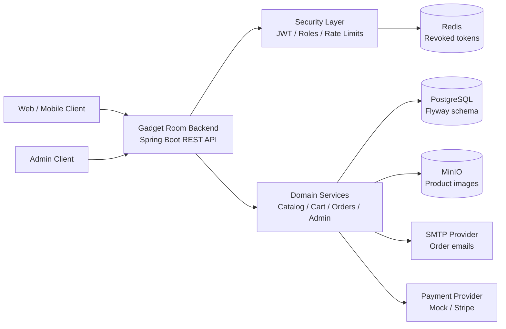

# Gadget Room Backend

> REST API for an online phone store. The backend covers catalog browsing, cart and checkout flows, admin operations,
> JWT security, image storage, email notifications, payment webhooks and CI quality gates.

## What Is Included

- [x] **Authentication:** registration, login, refresh tokens, logout, password reset and token revocation.
- [x] **Catalog:** phone listing, product details, filtering, sorting, pagination, brands, variants and images.
- [x] **Customer area:** user profile, cart, favorites, reviews and order history.
- [x] **Checkout:** direct order creation, cart checkout, delivery data, payment data and customer cancellation rules.
- [x] **Admin API:** product management, variants, images, customers, orders, KPI cards and dashboard analytics.
- [x] **Integrations:** PostgreSQL, Redis, MinIO, SMTP email sender, mock payment provider and Stripe webhook support.
- [x] **Operations:** Docker Compose, Flyway migrations, Actuator health checks, OpenAPI docs and JaCoCo coverage gate.

## Tech Stack

`Java 21` | `Spring Boot 3.5` | `Spring Security` | `Spring Data JPA` | `PostgreSQL` | `Flyway` | `Redis` | `MinIO` |
`JWT` | `MapStruct` | `Lombok` | `Docker` | `JUnit 5` | `Mockito` | `Testcontainers` | `JaCoCo` | `OpenAPI`

## Architecture



More details are in [docs/ARCHITECTURE.md](docs/ARCHITECTURE.md).

## Documentation

| Document | Purpose |
| --- | --- |
| [Project showcase](docs/SHOWCASE.md) | Resume-friendly overview for recruiters and technical reviewers. |
| [Architecture](docs/ARCHITECTURE.md) | Runtime design, flows, data ownership and release risks. |
| [API documentation](docs/API.md) | OpenAPI contract and readable Swagger screenshots. |
| [Security model](docs/SECURITY_MODEL.md) | Authentication, authorization, production exposure and reviewer checklist. |
| [Quality and release readiness](docs/QUALITY.md) | Test strategy, CI, coverage and release checklist. |

## API Map

| Area | Base path | Access |
| --- | --- | --- |
| Authentication | `/api/auth/**` | Public |
| Logout | `/api/v1/logout` | Authenticated |
| Phones | `/api/v1/phones/**` | Public read, admin write |
| Filtering | `/api/v1/filter/**` | Public |
| Images | `/api/v1/images/**` | Public read |
| Delivery | `/api/v1/delivery/**` | Public |
| Cart | `/api/v1/me/cart/**` | Authenticated |
| Favorites | `/api/v1/me/favorites/**` | Authenticated |
| Reviews | `/api/v1/phones/{phoneId}/reviews/**` | Public read, authenticated write |
| Orders | `/api/v1/orders/**` | Authenticated |
| Payment webhooks | `/api/v1/payments/webhooks/**` | Public provider callback |
| Admin | `/api/v1/admin/**` | Admin |
| Health | `/actuator/health/**` | Public |

## Screenshots

The project exposes OpenAPI documentation in local and development profiles:


Full Swagger UI screenshots are split into readable sections in [docs/API.md](docs/API.md).

The CI pipeline also produces a JaCoCo report and enforces the configured coverage gate:


## API Documentation

Swagger is available only outside the production profile:

- Swagger UI: `http://localhost:8080/swagger-ui.html`
- OpenAPI JSON: `http://localhost:8080/v3/api-docs`
- Full API screenshot gallery: [docs/API.md](docs/API.md)
- Saved development OpenAPI contract: [docs/api/openapi-dev.json](docs/api/openapi-dev.json)

The production profile disables public API docs and test-data endpoints.


## Production Notes

- `prod` disables `/api/v1/test-data/**`, Swagger UI and `/v3/api-docs`.
- `/actuator/health`, `/actuator/health/liveness` and `/actuator/health/readiness` stay public.
- Non-health actuator endpoints require the admin role and must be explicitly exposed.
- Auth-sensitive endpoints are rate-limited: login, refresh token, forgot password and reset password.
- Readiness checks include PostgreSQL, Redis and MinIO.

Rate limits can be tuned with:

```text
AUTH_RATE_LIMIT_REQUESTS_PER_WINDOW=10
AUTH_RATE_LIMIT_WINDOW=1m
```

## QA Guides

- [English QA guide](qa/guide_en.md)
- [Ukrainian QA guide](qa/guide_ua.md)
