# API Documentation

> Local OpenAPI documentation for Gadget Room Backend. The screenshots below are captured from the `dev` profile and
> show the full Swagger UI in readable sections.

## Contract

- Swagger UI: `http://localhost:8080/swagger-ui.html`
- OpenAPI JSON: `http://localhost:8080/v3/api-docs`
- Saved development contract: [docs/api/openapi-dev.json](api/openapi-dev.json)

Swagger and OpenAPI JSON are intentionally disabled in the `prod` profile.

## Endpoint Groups

| Area | Base path | Notes |
| --- | --- | --- |
| Authentication | `/api/auth/**` | Registration, login, refresh token and password reset. |
| Logout | `/api/v1/logout` | Revokes the current token. |
| Catalog | `/api/v1/phones/**`, `/api/v1/filter/**` | Public catalog reads, admin catalog writes. |
| Customer | `/api/v1/users/**`, `/api/v1/me/**` | Profile, cart and favorites. |
| Reviews | `/api/v1/phones/{phoneId}/reviews/**` | Public reads, authenticated writes. |
| Orders | `/api/v1/orders/**` | Checkout, history, details and cancellation. |
| Payments | `/api/v1/payments/webhooks/**` | Provider callbacks. |
| Admin | `/api/v1/admin/**` | Products, orders, customers and dashboard analytics. |
| Images | `/api/v1/images/**` | Public image serving and metadata. |
| Delivery | `/api/v1/delivery/**` | Delivery providers and pickup points. |

## Swagger UI

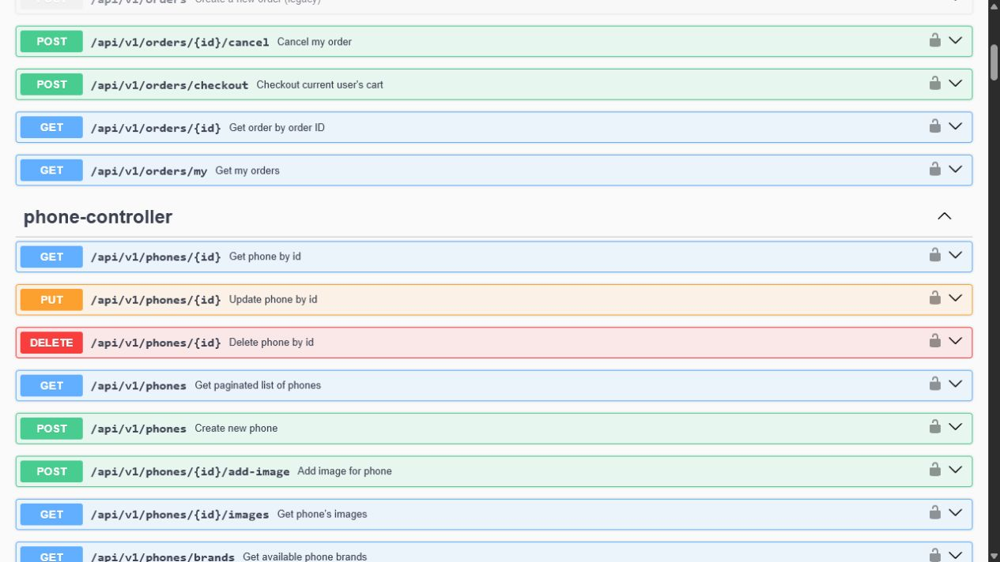

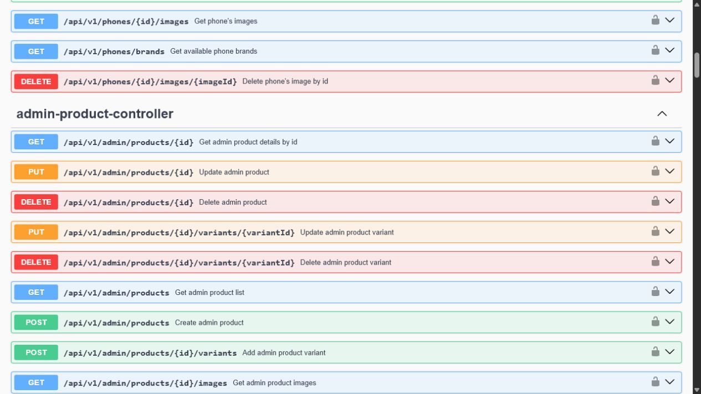

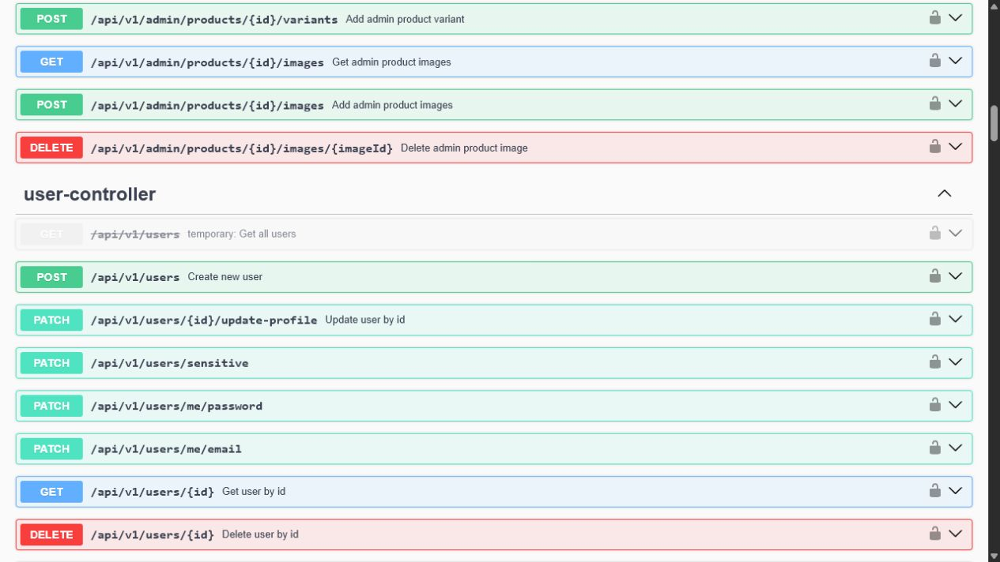

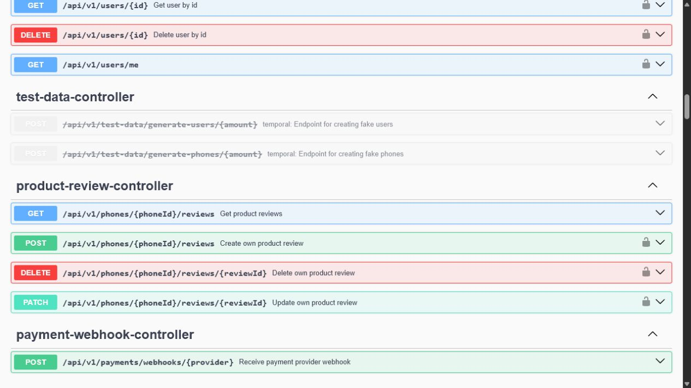

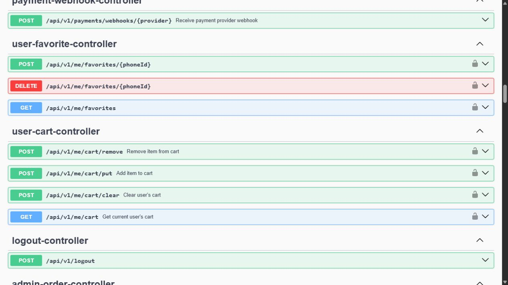

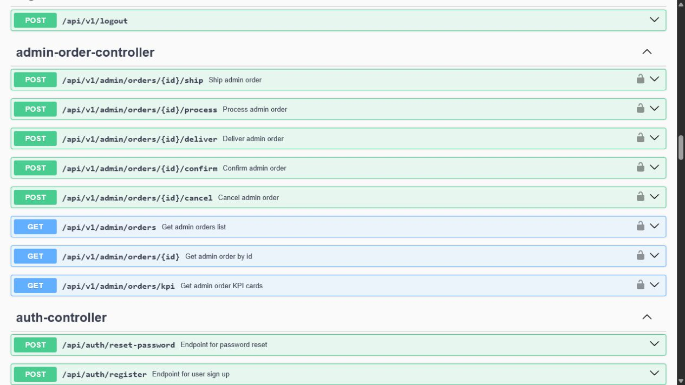

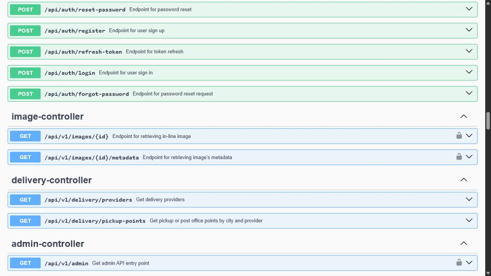

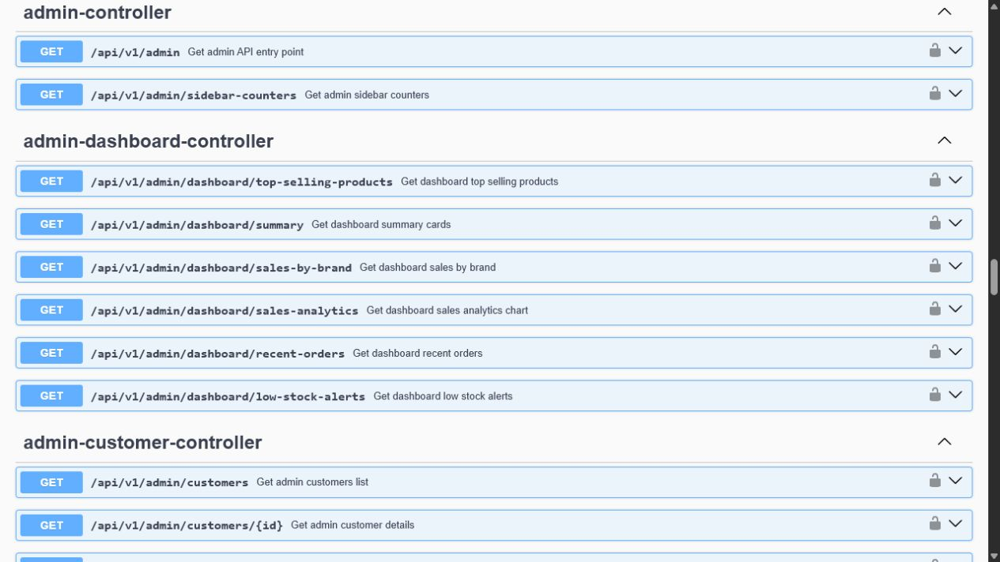

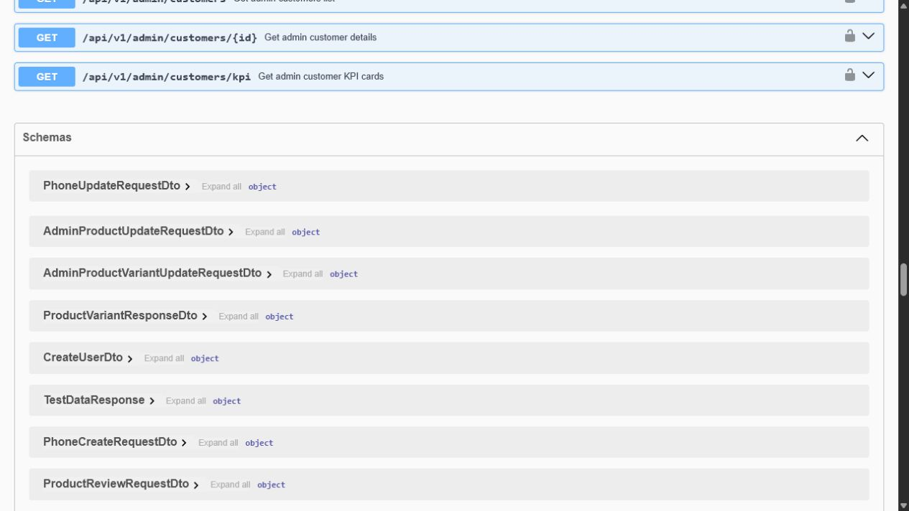

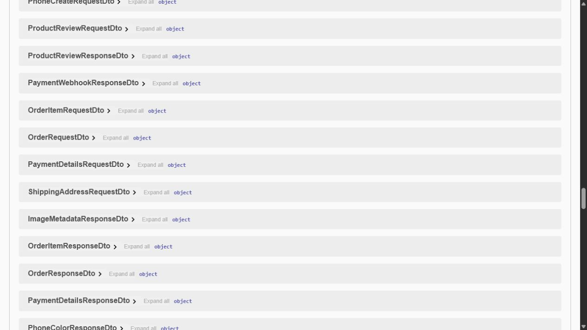

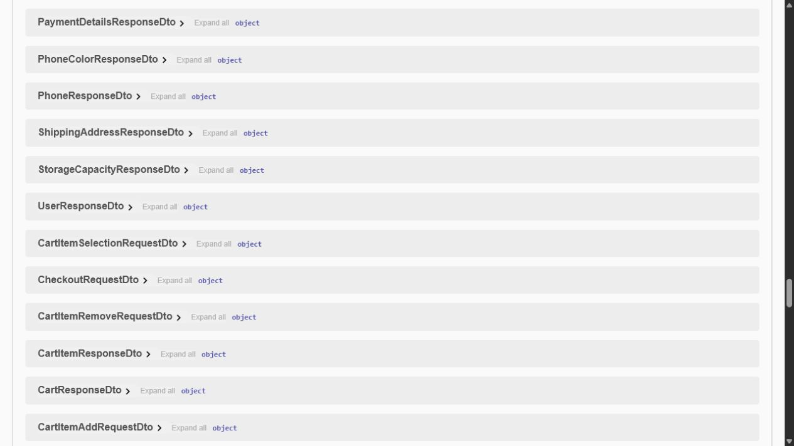

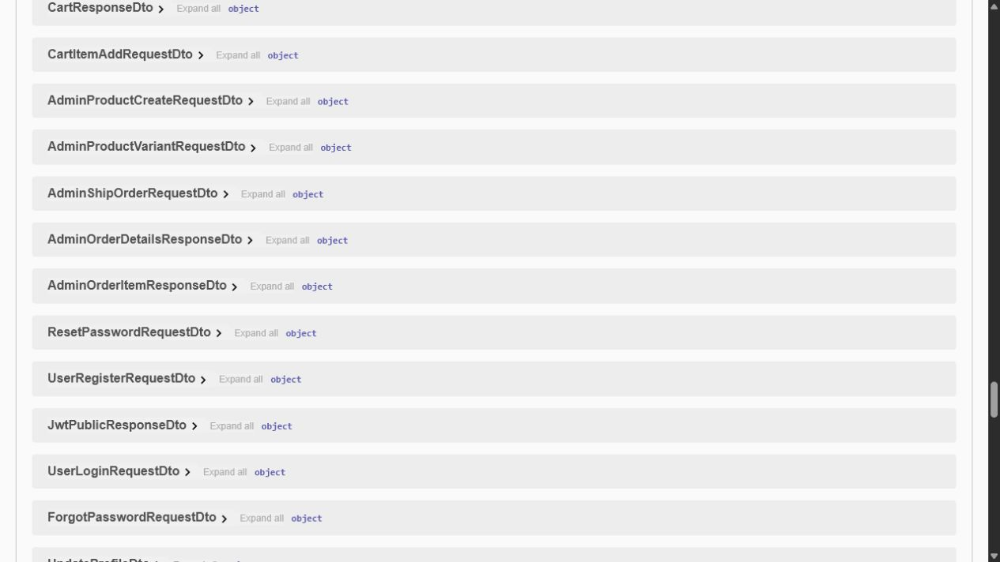

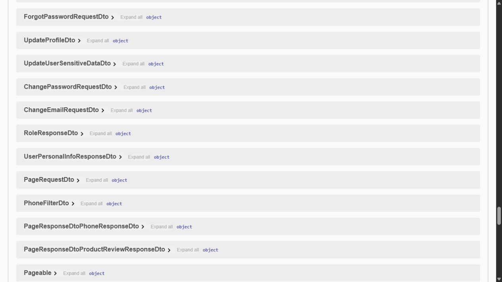

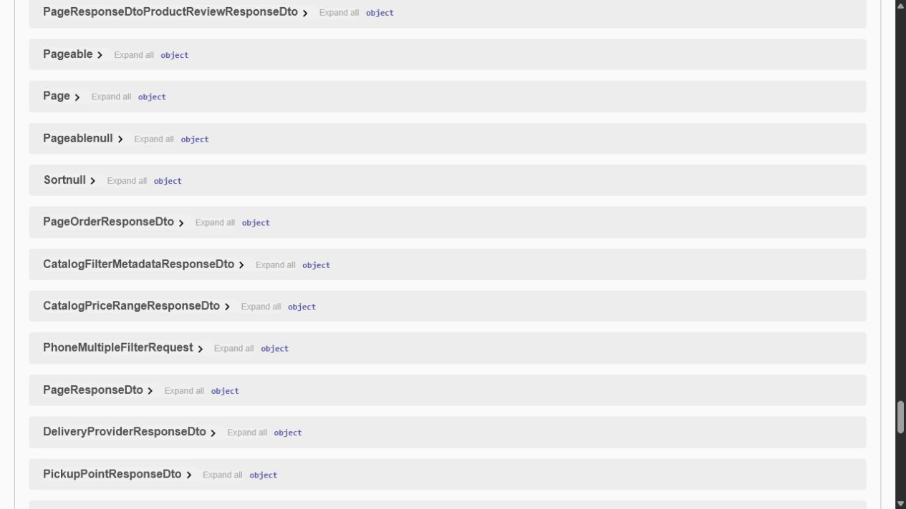

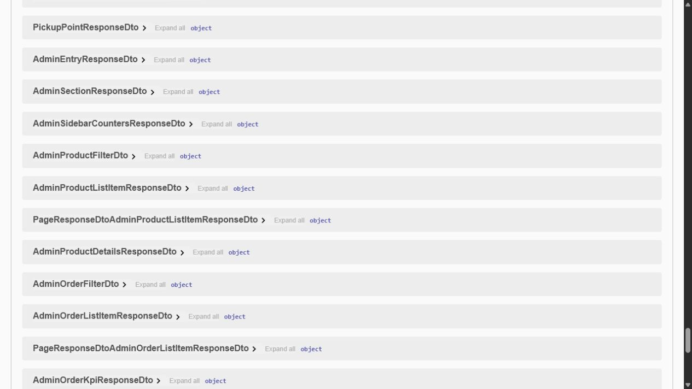

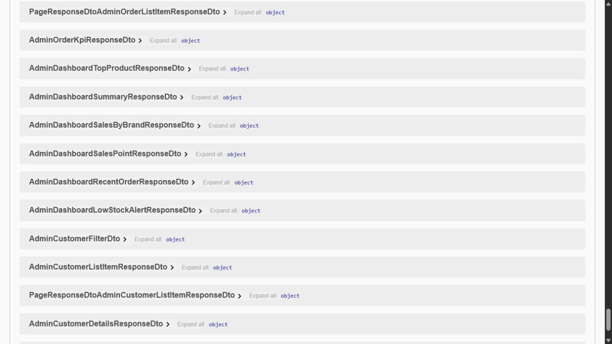

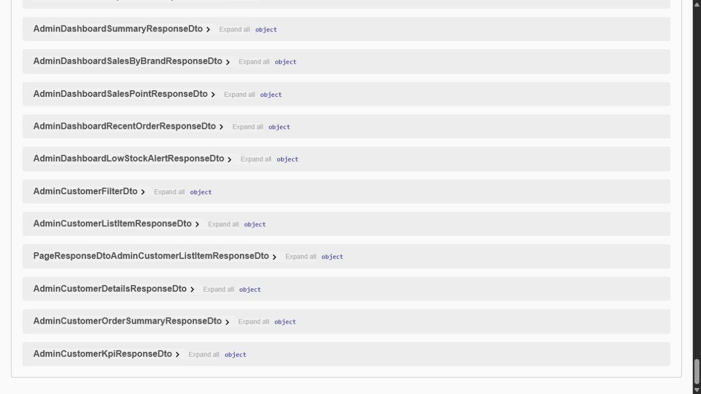
