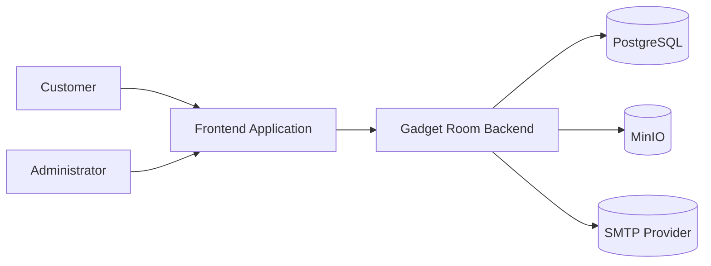
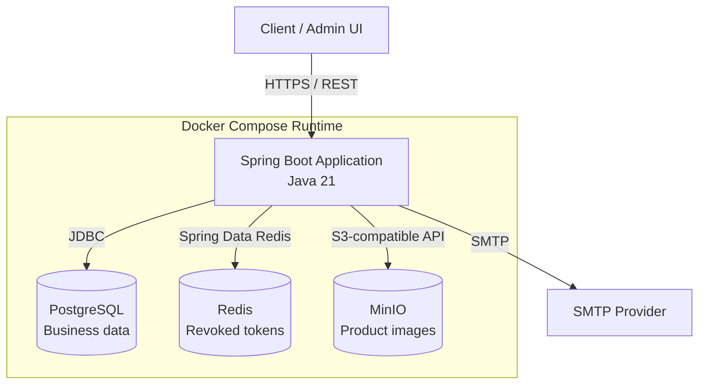
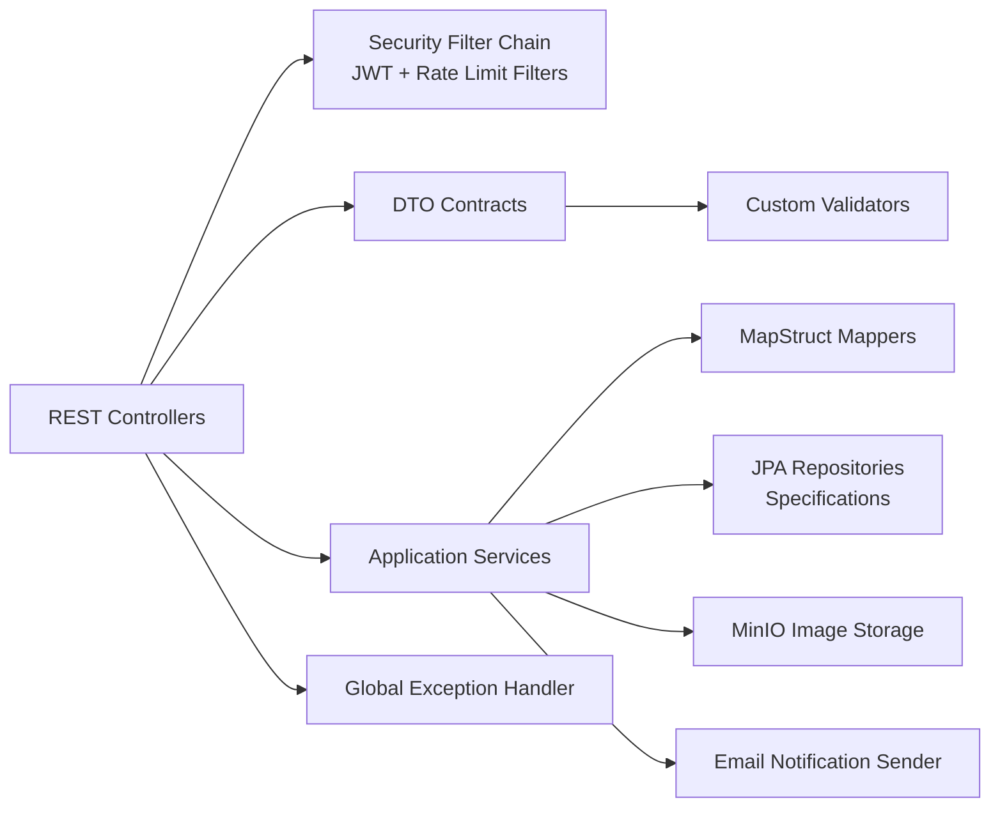
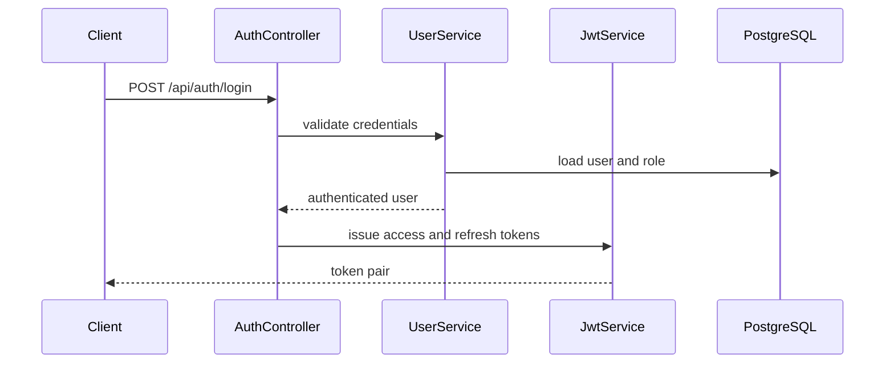
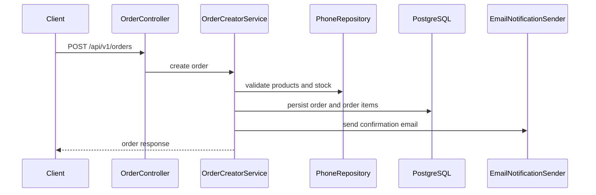
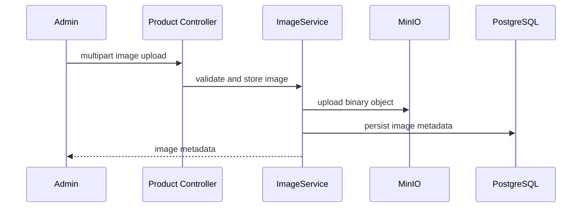

# Architecture

> System design notes for Gadget Room Backend.

## Goals

- Provide a clean REST API for an online phone store.
- Keep domain logic independent from HTTP and persistence details.
- Support authenticated customer workflows and protected admin workflows.
- Store relational business data in PostgreSQL and binary product images in MinIO.
- Keep deployments reproducible with Docker, Flyway and environment-based configuration.

## System Context

## Container View

## Component View

## Runtime Flows

### Authentication

### Order Creation

### Product Image Upload

## Data Ownership

| Data | Owner | Storage |
| --- | --- | --- |
| Users and roles | User domain | PostgreSQL |
| Phones and characteristics | Catalog domain | PostgreSQL |
| Carts and cart items | Cart domain | PostgreSQL |
| Orders, payments and shipping | Order domain | PostgreSQL |
| Product image metadata | Image domain | PostgreSQL |
| Product image binaries | Image storage adapter | MinIO |
| Password reset tokens | Auth domain | PostgreSQL |
| Revoked access and refresh tokens | Auth domain | Redis |

## Security Model

- Public endpoints: authentication, selected catalog endpoints, delivery lookup, payment webhooks, order creation and health checks.
- Local/dev-only endpoints: API documentation and `/api/v1/test-data/**`.
- Production profile: disables public API documentation and does not register test-data endpoints.
- Authenticated endpoints: user profile, cart and customer order history.
- Admin endpoints: `/api/v1/admin/**`.
- Actuator: health endpoints are public; non-health actuator endpoints require the admin role and are exposed only when explicitly configured.
- Rate limiting: login, refresh token, forgot password and reset password are limited per client IP and endpoint.
- Token model: access token, refresh token, remember-me refresh token and reset token.
- Password storage: BCrypt.
- Session model: stateless.

## Observability

- Spring Boot Actuator exposes health probes at `/actuator/health`, `/actuator/health/liveness` and `/actuator/health/readiness`.
- Readiness includes PostgreSQL, Redis and MinIO health contributors.
- Health details are hidden from unauthenticated callers and available to authorized actuator access.

## Quality Gates

- Pull requests to `develop` and `main` run the CI pipeline.
- CI executes `mvn -B clean verify -Dspring.profiles.active=dev`.
- JaCoCo enforces 70% minimum line coverage.
- Integration tests use Testcontainers for PostgreSQL, Redis and MinIO.
- Test datasource pools are capped to avoid exhausting PostgreSQL connections when Spring creates multiple integration-test contexts.

## Design Decisions

| Decision | Reason |
| --- | --- |
| PostgreSQL for business data | Strong relational consistency for users, carts, orders and catalog data. |
| MinIO for images | Keeps binary files out of the relational database and provides S3-compatible storage. |
| Flyway migrations | Makes schema evolution explicit and repeatable across environments. |
| JWT authentication | Enables stateless API security for frontend clients. |
| MapStruct | Keeps DTO mapping compile-time checked and easy to review. |
| Testcontainers | Validates integration behavior against real infrastructure dependencies. |
