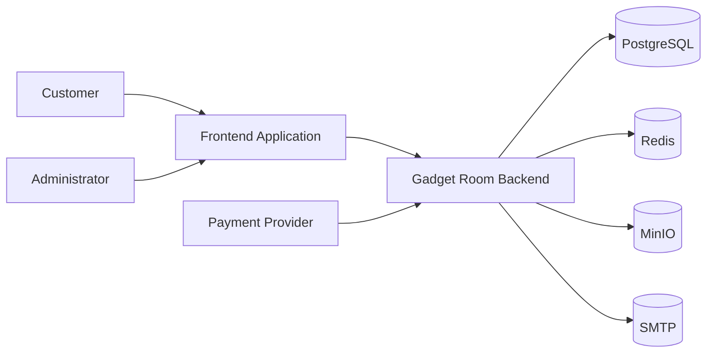
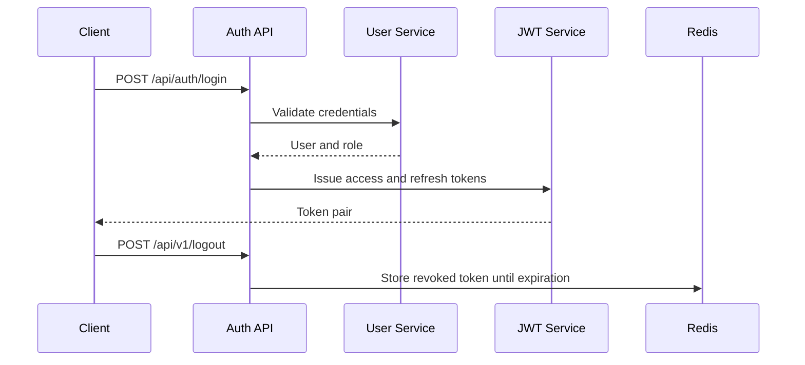
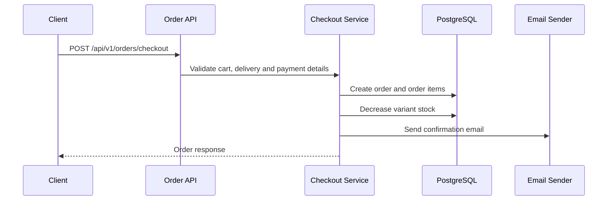
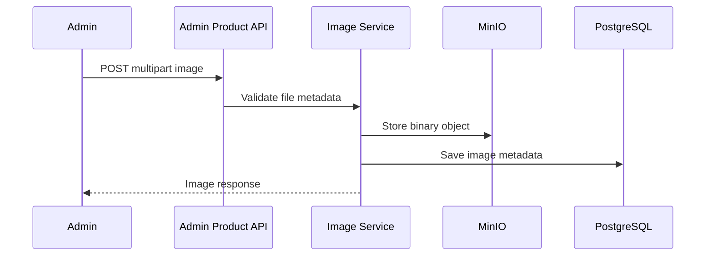

# Architecture

> Design notes for Gadget Room Backend. This document stays short on purpose: it explains the decisions that matter
> during review, debugging and release preparation.

## System Context

## Runtime Components

| Component | Responsibility |
| --- | --- |
| REST controllers | HTTP contracts, validation entry points and response codes. |
| Security filters | JWT parsing, auth rate limiting, role checks and stateless session handling. |
| Services | Application use cases: catalog, cart, checkout, orders, users, reviews and admin analytics. |
| Repositories | PostgreSQL access through Spring Data JPA and specifications. |
| Mappers | DTO/entity conversion with MapStruct. |
| Validators | Business input checks for checkout, payment, delivery, filters and user data. |
| Storage adapter | Product image upload and download through MinIO. |
| Notification adapter | Order and status emails through SMTP and Thymeleaf templates. |

## Main Flows

### Authentication

### Checkout

### Product Image Upload

## Data Ownership

| Data | Owner | Storage |
| --- | --- | --- |
| Users, roles and password reset tokens | Auth/User domain | PostgreSQL |
| Revoked access and refresh tokens | Auth domain | Redis |
| Phones, variants, colors and storage options | Catalog domain | PostgreSQL |
| Product images metadata | Image domain | PostgreSQL |
| Product images binaries | Image storage adapter | MinIO |
| Carts and cart items | Cart domain | PostgreSQL |
| Orders, order items, delivery and payment metadata | Order domain | PostgreSQL |
| Reviews and favorites | Customer domain | PostgreSQL |

## Security Model

- Session policy is stateless.
- Passwords are hashed with BCrypt.
- JWT access tokens protect authenticated and admin-only endpoints.
- Redis stores revoked access and refresh tokens until expiration.
- Admin APIs are grouped under `/api/v1/admin/**`.
- Swagger and `/api/v1/test-data/**` are not available in the production profile.
- Login, refresh token, forgot password and reset password are rate-limited.
- Health probes are public; non-health actuator endpoints require admin access.

## Persistence

- Flyway owns schema changes.
- `dev` loads both production migrations and `db/migration-dev` seed data.
- `prod` uses only production migrations.
- JPA validates the schema on startup instead of generating it.
- Product binaries stay outside PostgreSQL; the database stores only image metadata and MinIO keys.

## Quality Gates

- CI runs on pull requests to `develop` and `main`.
- The verification command is `mvn -B clean verify -Dspring.profiles.active=dev`.
- Integration tests use Testcontainers for PostgreSQL, Redis and MinIO.
- JaCoCo enforces a 70% minimum line coverage threshold.
- Production-readiness behavior is covered by profile-specific tests.

## Release Risks To Watch

- Flyway migrations are irreversible in shared environments; review SQL names and order carefully.
- `spring.jpa.open-in-view` still uses the Spring Boot default. Disabling it should be handled as a separate code change
  with query-loading fixes and regression tests.
- Payment webhooks are public by design; provider signature validation must stay aligned with the active provider.
- Docker volumes keep local data between runs. Use the documented reset command before testing migration changes.
