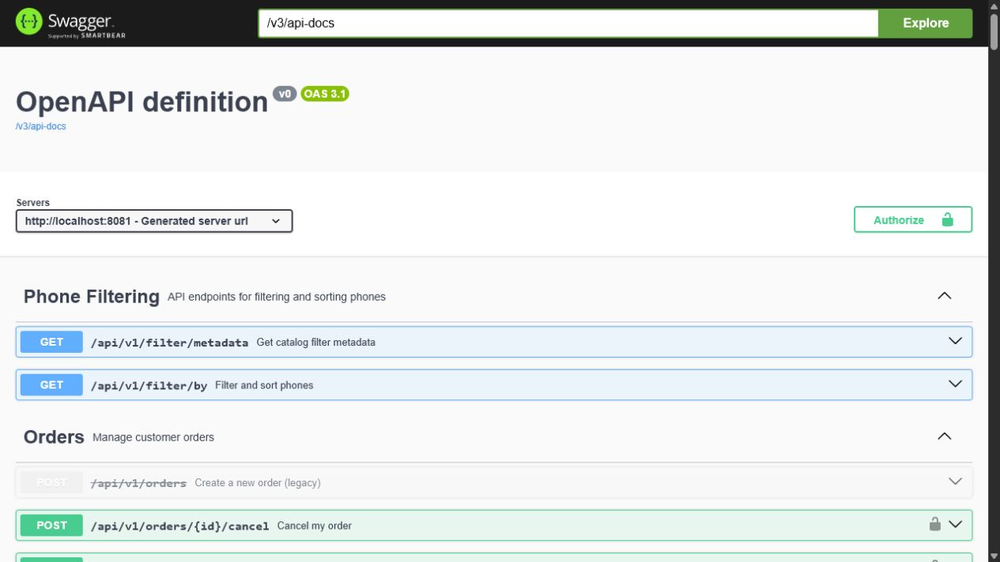
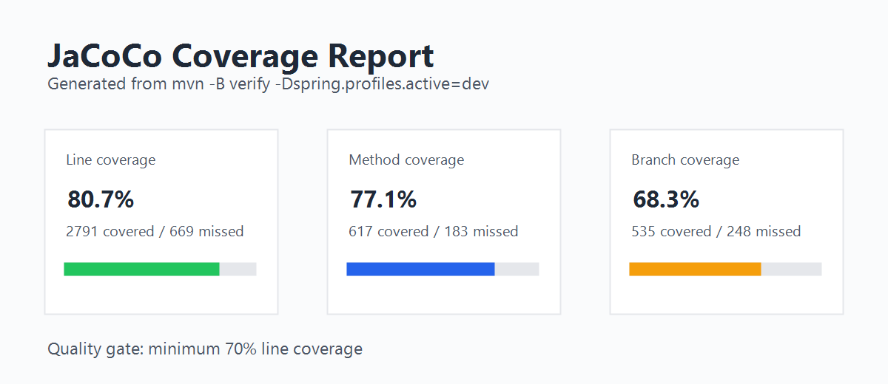

# Project Showcase

> A resume-friendly summary of what Gadget Room Backend demonstrates. It is written for quick review by engineers,
> recruiters and technical interviewers.

## Summary

Gadget Room Backend is a production-oriented Spring Boot REST API for an online phone store. It combines common
e-commerce workflows with infrastructure concerns that are usually expected in real backend projects: authentication,
role-based admin APIs, object storage, migrations, API documentation, integration tests and CI quality gates.

## What This Project Demonstrates

- Designing REST APIs with clear customer and admin boundaries.
- Implementing stateless JWT security with token revocation.
- Modeling e-commerce flows: catalog, variants, cart, checkout, orders, delivery and payment metadata.
- Keeping database changes reproducible with Flyway.
- Storing binary product images outside the relational database with MinIO.
- Testing against real dependencies through Testcontainers.
- Running repeatable verification through GitHub Actions and JaCoCo.
- Preparing release branches and documentation for review.

## Highlights For Reviewers

| Area | Why it matters |
| --- | --- |
| API contract | Swagger/OpenAPI makes the backend easy to inspect and integrate. |
| Security | JWT, BCrypt, token revocation, role-based admin access and rate limits. |
| Persistence | PostgreSQL schema is versioned and validated on startup. |
| Storage | Images use S3-compatible MinIO instead of bloating relational tables. |
| Testing | Unit, controller and integration tests cover both business logic and infrastructure behavior. |
| Operations | Docker Compose, health probes and production profile controls support realistic deployment workflows. |

## Screenshots

Full Swagger screenshots are available in [API.md](API.md).

## Review Path

1. Start with [README.md](../README.md) for the project overview.
2. Open [ARCHITECTURE.md](ARCHITECTURE.md) for runtime design and data ownership.
3. Open [API.md](API.md) for the OpenAPI contract and Swagger screenshots.
4. Open [SECURITY_MODEL.md](SECURITY_MODEL.md) for auth and production exposure.
5. Open [QUALITY.md](QUALITY.md) for tests, CI and release readiness.
